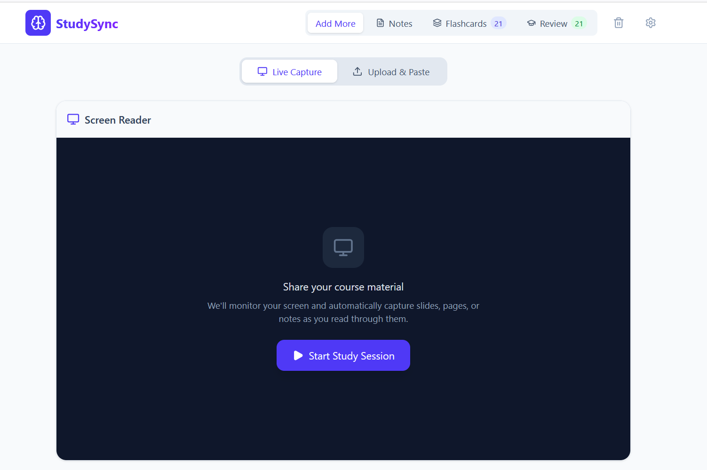
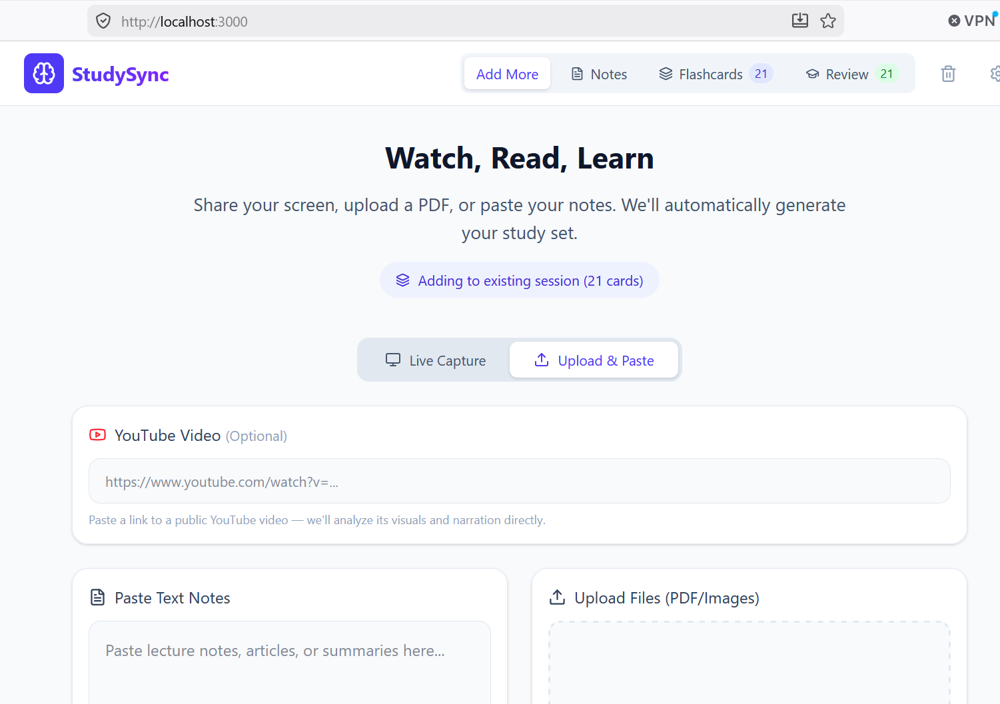
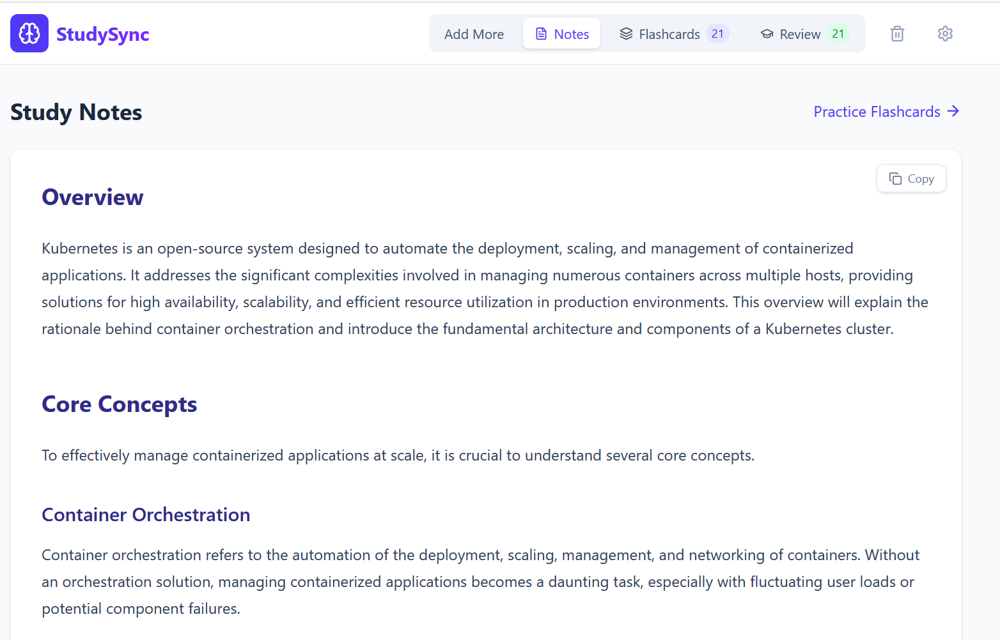

# StudySync AI

A personal study companion that turns whatever you're studying into structured notes and spaced-repetition flashcards. Point it at your screen while you read, upload a PDF, paste text, or drop in a YouTube link. It generates clean study notes and an SM-2 scheduled flashcard deck from the material, and it can listen to your narration while you study.

## Features

- **Screen capture study sessions.** Share a window or tab and StudySync periodically snapshots what you're reading, optionally with microphone narration, and generates notes and flashcards from it automatically.
- **Multiple input types.** PDFs, images, pasted text, and YouTube links all work alongside screen capture.
- **Structured notes.** Notes come back in a consistent sectioned format (summary, core concepts, definitions, examples) rendered as clean markdown.
- **Spaced-repetition flashcards.** Cards are scheduled with the SM-2 algorithm. Failed cards stay due for same-session relearning, and your deck persists locally between sessions.
- **Fact verification.** An on-demand second AI pass reviews your notes and flashcards for likely misinformation — suspect passages get highlighted inline with an explanation, and questionable cards get a "Check accuracy" badge. (It checks against the model's general knowledge, so it's a plausibility check, not source verification.)
- **Editing.** Notes are editable as raw markdown, and flashcards can be edited, deleted, or added by hand — manual cards enter the same review schedule as generated ones.
- **Export.** Download your notes as Markdown (drops straight into Obsidian) or plain text, and your flashcards as CSV for Anki.
- **Multi-provider AI.** Works with Google Gemini, Anthropic Claude, OpenAI, or any local OpenAI-compatible runtime (Ollama, LM Studio, and similar). Switch providers and manage keys from the in-app settings.
- **Graceful degradation.** If the active provider can't handle an input type (say, audio on a non-Gemini model), the server strips it and warns you instead of failing the generation.

## Screenshots

**Live capture** — share your screen and StudySync snapshots what you read:



**Upload & paste** — PDFs, images, text, or a YouTube link:



**Generated study notes:**



## How it works

The app is a Vite + React 19 + TypeScript client with a small Express proxy server. The client never talks to AI providers directly. It sends text, files, and URLs to `/api/generate`, and the server routes the request to the configured provider adapter, assembles the canonical note structure, and returns markdown plus flashcards.

```
client (Vite, port 3000)  →  /api proxy  →  Express (port 3001)  →  provider adapter
                                                                     ├─ Gemini
                                                                     ├─ Anthropic
                                                                     ├─ OpenAI
                                                                     └─ local (OpenAI-compatible)
```

API keys live on the server only, either in `.env.local` or in a gitignored `server/config.json` written by the settings UI. The settings endpoint reports whether a key is set, never the key itself.

## Getting started

**Prerequisites:** Node.js 18+ and an API key for at least one supported provider.

1. Install dependencies:

   ```bash
   npm install
   ```

2. Create `.env.local` in the project root with your key:

   ```bash
   GEMINI_API_KEY=your-key-here
   ```

   Gemini is the default provider and the most capable here (it handles audio and YouTube input natively). You can also add `ANTHROPIC_API_KEY` or `OPENAI_API_KEY`, or enter keys later through the in-app settings (gear icon).

3. Start the app:

   ```bash
   npm run dev
   ```

   This runs the Express server and the Vite dev server together. Open http://localhost:3000.

## Scripts

| Command | What it does |
| --- | --- |
| `npm run dev` | Server + client together for development |
| `npm run lint` | Type-check with `tsc --noEmit` |
| `npm run build` | Production build |
| `npm run preview` | Preview the production build |

## Project structure

```
App.tsx                  View routing, session state, localStorage persistence
components/
  InputSection.tsx       Capture, upload, and text input UI
  NotesView.tsx          Rendered study notes
  FlashcardDeck.tsx      Review UI backed by SM-2 scheduling
  SettingsModal.tsx      Provider and API key settings
services/
  api.ts                 Thin fetch client for the server
  srs.ts                 SM-2 scheduling (local-time dates)
server/
  index.mjs              Express proxy: routing, capability stripping, settings
  prompt.mjs             Shared prompt text, JSON schema, markdown assembly
  providers/             Gemini, Anthropic, and OpenAI-compatible adapters
  settings.mjs           Provider/key settings backed by server/config.json
```

## Provider capabilities

Not every provider supports every input type. The server handles the differences for you:

| Input | Gemini | Anthropic | OpenAI | Local |
| --- | --- | --- | --- | --- |
| Text / PDFs / images | ✅ | ✅ | ✅ | text only |
| Narration audio | ✅ | stripped | stripped | stripped |
| YouTube links | ✅ | stripped | stripped | stripped |

Stripped inputs surface as a warning banner in the UI, and generation continues with whatever the provider can process.
